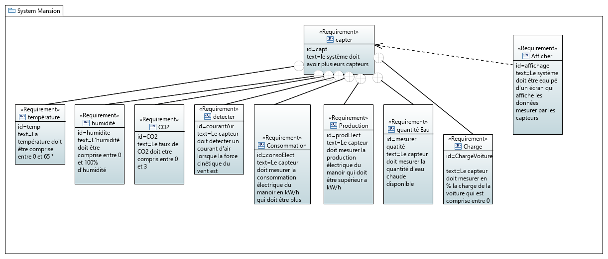
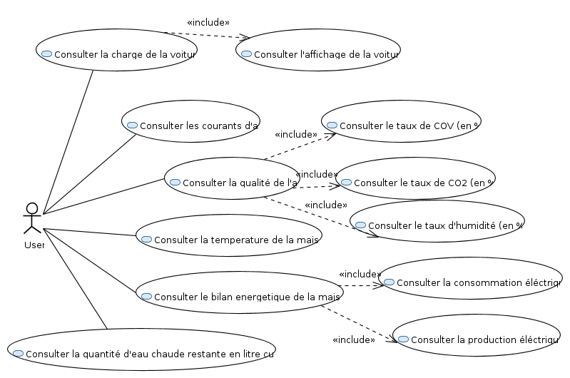
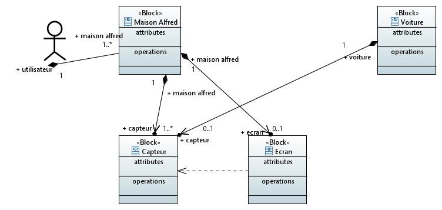
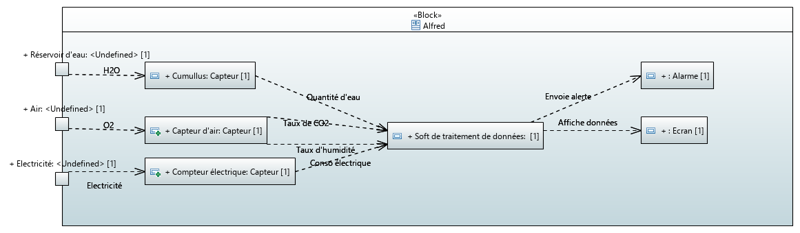

# Rapport activité
## Diagramme d'exigence

### Description
Le système du manoir requiert des capteurs qui mesure plusieurs valeurs de la maison.
Ces capteurs sont composés de mesures de plusieurs indicateurs tels que la température, la production d'électricité, la charge de la voiture en différentes mesures.
Aussi, le système de la maison contient un écran qui affiche les valeurs mesurer par les capteurs et qui, par conséquent, dépend des capteurs. 

## Diagramme use case 

### Description
L'utilisateur peut consulter le taux de charge de sa voiture en consultant l'affichage à l'intérieur de sa voiture. 
L'utilisateur peut aussi consulter la présence ou non de courant d'air et voir la puissance de celui-ci.
L'utilisateur peut aussi consulter la qualité de l'air en la calculant lui même par rapport aux valeur du taux de CO2 et du taux d'humidité
L'utilisateur peut consulter la température de la maison qui doit être comprise entre 0 et 65 °.
L'utilisateur peut consulter le bilan énergétique de la maison en consultant la production ainsi que la consommation électrique
L'utilisateur peut consulter la quantité d'eau chaude disponible actuellement et peut par conséquent calculer dans combien de temps il pourra prendre une douche chaude.

## Diagramme BDD

### Description
Il y a 4 sortes d'objets et 1 acteur : l'utilisateur qui va intéragir avec le système de la maison. 
Celui-ci va contient des capteurs, 1 écran. 
La voiture va être composé de capteurs qui permettront l'affichage de son taux de chargement. 
L'écran est dépendant des capteurs puisqu'il va afficher les valeurs mesurer par les capteurs. 

## Diagramme IBD

# Diagramme de séquence

### Description
L'utilisateur doit aller à l'écran et selectionner l'icône "Energie",
l'écran va envoyer une requête au système qui va activer
les capteurs concernés. Ceux-ci vont prendre leurs mesures et les renvoyer au système.
Le système va traiter les données et va les envoyer en réponse à l'écran. L'écran va lui,
afficher un feed-back visuel.

# SUJET DU DEPART : Alfred - Majordome de Batman

L’idée est de créer un système qui viendra rendre les services suivants :

- Affichage d’un indicateur de santé de la maison. Cet indicateur doit être capable de combiner les informations provenant de la mesure de plusieurs grandeurs physiques:
  - Température
  - Humidité
  - CO2
  - COV
  - Déplacement d’air (détecter un courant d’air)
  - Consommation électrique de la maison
  - Production électrique
  - Quantité d’eau chaude restante 
  - Charge de la voiture électrique (optionnel en fonction de ce qu’affiche la voiture)
  - Ratio production / consommation
  - etc.
- Affichage des indicateurs détaillés sur différents domaines (en instantané et avec des graphiques) / en le ramenant à des indicateurs intelligibles pour l’humain 
  - Qualité de l’air 
  - Consommation électrique (par rapport à une journée type de la saison ou bien en €)
  - Production électrique (par rapport à une journée type de la saison ou bien en €)
  - Voiture (en capacité de déplacement)
  - Quantité d’eau chaude (en nombre de douche ou autres)
  - Ratio production/consommation électrique
- Affichage des prévisions pour la journée / pour la semaine
  - Qualité de l’air
  - Consommation électrique prévue
  - Production d’énergie prévue
  - La voiture sera chargée pour faire votre trajet quotidien à 16h30…
  - Vous pourrez prendre une douche chaude à 8h10 demain matin …
  - Prévision du ratio production / consommation
- Affichage de conseils / alertes pour bénéficier au mieux des capacités passives de la maison
  - Ouvrir la fenêtre pendant 10 minutes
  - Ne pas faire entrer de nouveaux visiteurs
  - Limiter à 5 pendant les 2 prochaines heures le nombre de personnes présentes dans la maison
  - N’oubliez pas de fermer la fenêtre
  - Faire des signaux sonores (~ alarme environnementale)
  - ….

Pour réaliser ce système vous devrez:
- éliciter les exigences (P1)
- Bien identifier le système et ses acteurs (P2)
- Définir les principales missions et scénarios d’utilisation du système (P2)
- Définir les principales fonctions du système, les intéractions et les échanges de flux entre elles (P2)
- Définir les principaux mode de fonctionnement du système (P2)

Organisation du travail : 
Le projet se déroulera en groupe de 2 étudiants

Livrables : 
- Une présentation de votre modèle sur la dernière heure, en expliquant chacun d’entre eux et les choix de conception que vous avez fait. 
- Le modèle (i.e., votre projet Eclipse) qui devra être envoyé par email avant le vendredi 8 décembre à minuit: benoit.combemale@irit.fr et jean-michel.bruel@irit.fr

Bon courage :)
Benoit and Jean-Michel
